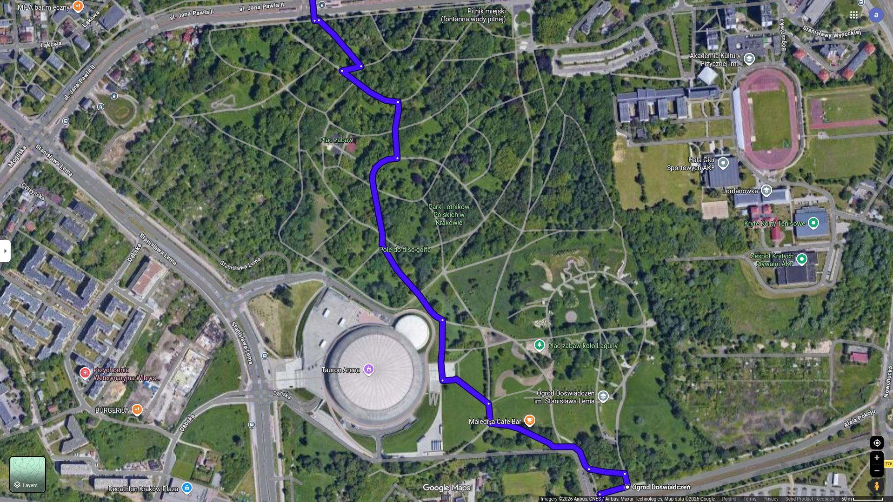
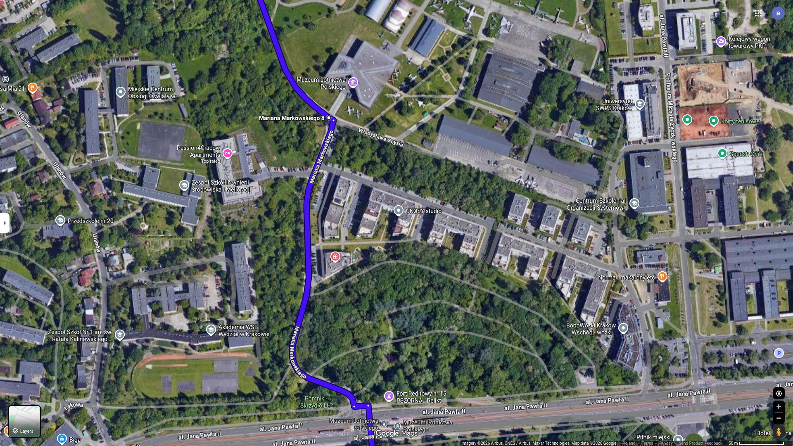
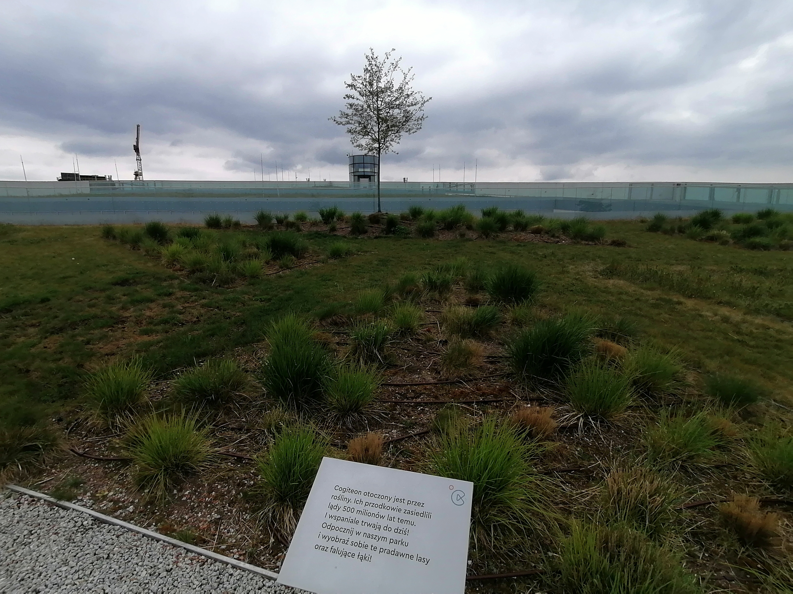
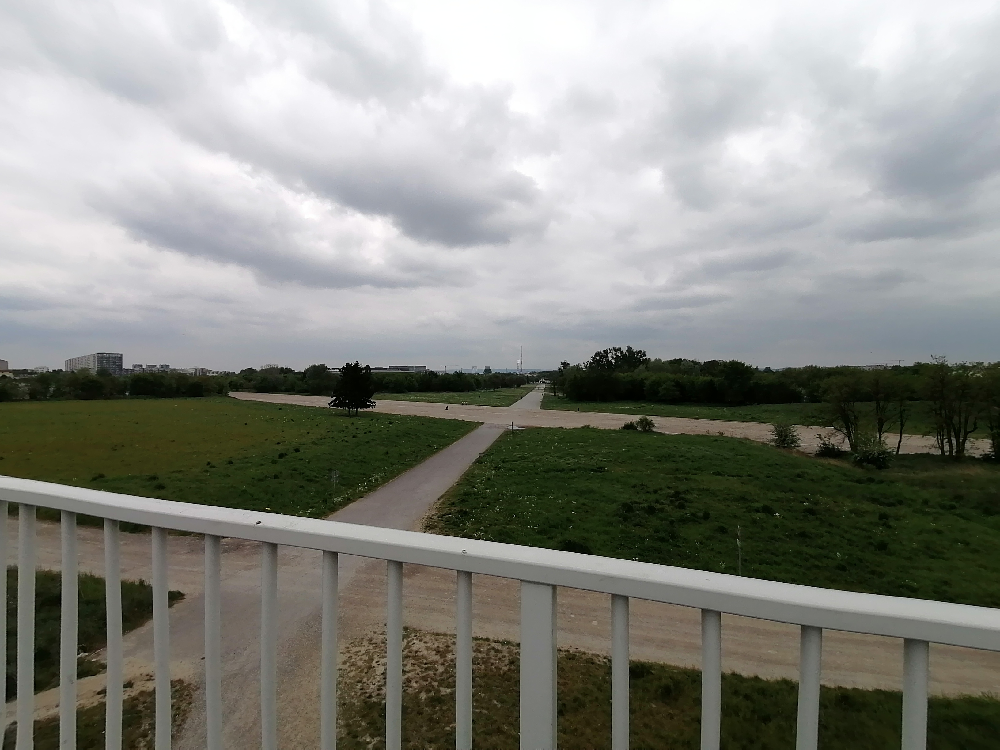
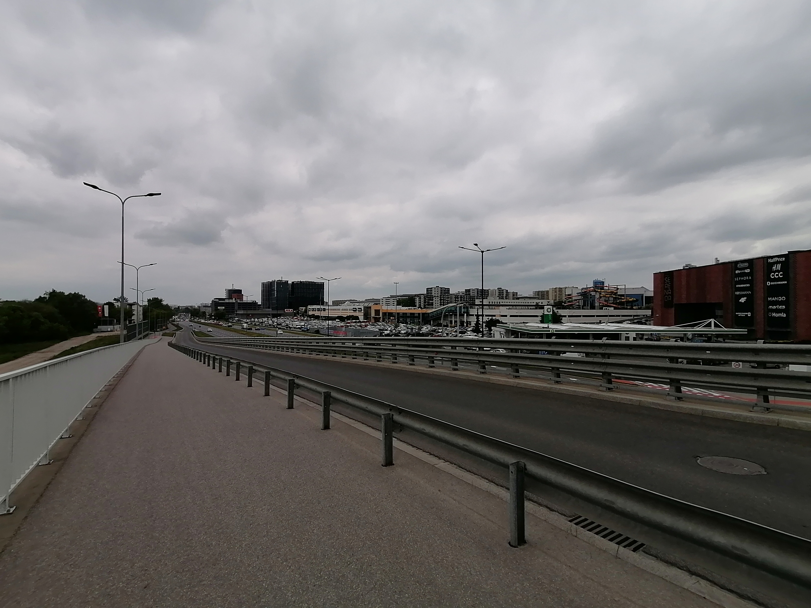

## Aviators Park

First do [To The Vistula](to-the-vistula.md)

### Contents

- [Bicycle Route Instruction](instruction.md)
- [Points](#points)
- [Map](#map)
- [Stats](#stats)
- [Trip](#trip)
    - [2026-05-09](#2026-05-09)

#### Points

List of route points for google map

- Coordinates

1. 50.05311988496777, 19.960142634517908
2. 50.0543845721069, 19.976206667149796
3. 50.0617698703226, 19.981799224878962
4. 50.065968310862786, 19.997716149455147
5. 50.076664945883174, 19.989372684325712
6. 50.08426853958845, 19.990744565713705
7. 50.086716501623044, 19.966419153908184
8. 50.08772725544606, 19.947750122592037

- Names

1. Bulwar Kurlandzki (Most Kotlarski)
2. Stopień wodny Dąbie
3. Przez Bulwary na Dąbiu do Aleja Pokoju
4. Wjazd do Park Lotników Polskich od Aleja Pokoju
5. Wjazd na Lotnisko Rakowice Czyżyny od Markowskiego
6. Lotnisko Rakowice Czyżyny
7. Park Zaczarowanej Dorożki

##### For Copying

```text
50.05311988496777, 19.960142634517908
50.0543845721069, 19.976206667149796
50.0617698703226, 19.981799224878962
50.065968310862786, 19.997716149455147
50.076664945883174, 19.989372684325712
50.08426853958845, 19.990744565713705
50.086716501623044, 19.966419153908184
50.08772725544606, 19.947750122592037
```

[Contents](#contents)

#### Map







[Contents](#contents)

#### Stats

- Time: 37 min
- Length: 10.5 km
- Mostly flat
- 37 m uphill
- 26 m downhill

#### Trip

##### 2026-05-09 

- Start: 12:00
- Temperature: 14 Celsius
- Notes:
    - Quite slow ride in parks, but i like trees.  
    - Took some fotos.  








[Contents](#contents)