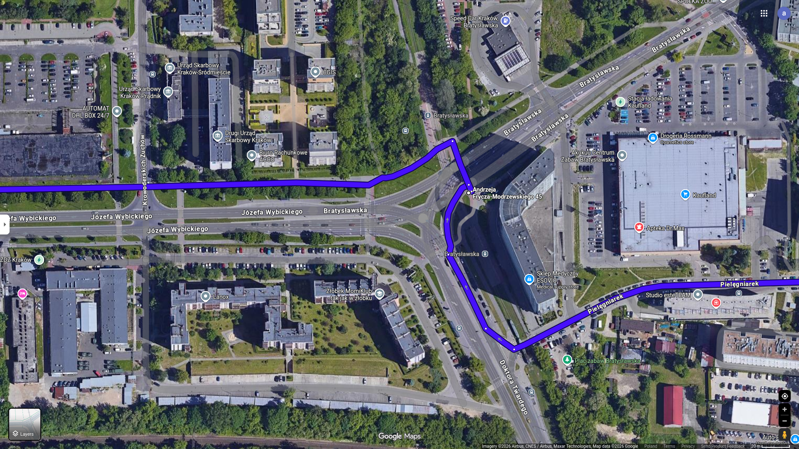
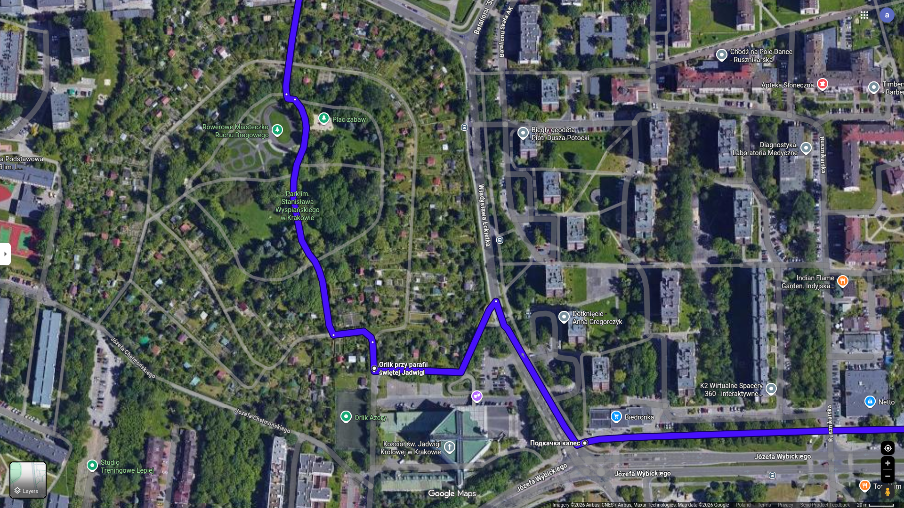

## Parks Nearby

### Contents

- [Bicycle Route Instruction](instruction.md)
- [Points](#points)
- [Map](#map)
- [Stats](#stats)
- [Trip](#trip)
    - [yyyy-mm-dd](#yyyy-mm-dd)

#### Points

List of route points for google map

- Coordinates

1. 50.083551477130406, 19.93784807619126
2. 50.08413157480634, 19.93399364373485
3. 50.08403560004025, 19.92420195944361
4. 50.08459731091385, 19.921732519054594
5. 50.08904629530059, 19.922017219162427
6. 50.09123336689333, 19.923095060199913
7. 50.08772725544606, 19.947750122592037

- Names

1. Skrzyżowanie Prądnicka Pielęgniarek
2. Ścieżka rowerowa przy ul. Bratysławska
3. Przy Kościół św. Jadwigi Królowej
4. Wjazd do Park im. Stanisława Wyspiańskiego
5. Park Krowoderski
6. Ścieżka rowerowa wzdłuż ul. Opolska
7. Plac Imbramowski

##### For Copying

```text
50.083551477130406, 19.93784807619126
50.08413157480634, 19.93399364373485
50.08403560004025, 19.92420195944361
50.08459731091385, 19.921732519054594
50.08904629530059, 19.922017219162427
50.09123336689333, 19.923095060199913
50.08772725544606, 19.947750122592037
```

[Contents](#contents)

#### Map







[Contents](#contents)

#### Stats

- Time: 19 min
- Length: 4.9 km
- Mostly flat
- 12 m uphill
- 19 m downhill

#### Trip

##### yyyy-mm-dd 

- Start: hh:mm
- Temperature: x Celsius

Note

[Contents](#contents)