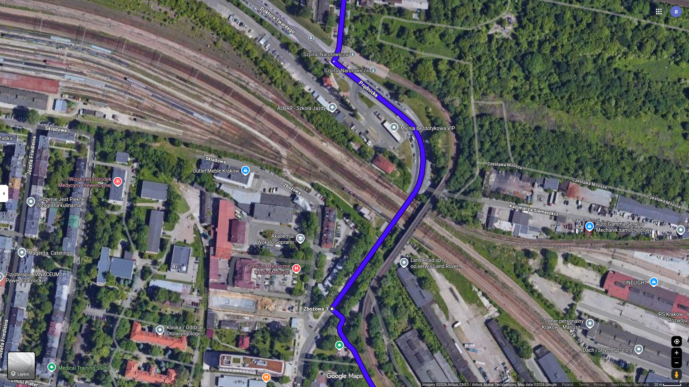
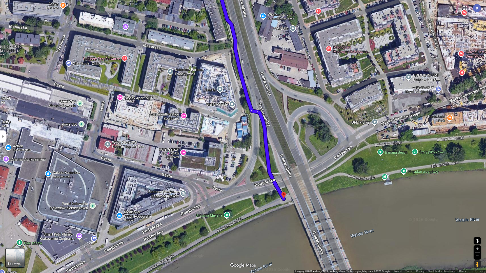

## To The Vistula

### Contents

- [Bicycle Route Instruction](instruction.md)
- [Points](#points)
- [Map](#map)
- [Stats](#stats)
- [Trip](#trip)
    - [2026-05-04](#2026-05-04)

#### Points

List of route points for google map

- Coordinates

1. 50.083551477130406, 19.93784807619126
2. 50.07812159362235, 19.937290844030667
3. 50.07605366840922, 19.940313470751548
4. 50.070000350328804, 19.95038334418374
5. 50.06832522230536, 19.952635273669213
6. 50.06558610279575, 19.95944843214387
7. 50.05710730412067, 19.958494750864507
8. 50.05311988496777, 19.960142634517908

- Names

1. Skrzyżowanie Prądnicka Pielęgniarek
2. Skatepark Prądnicka w Park Kleparski
3. Dworzec Towarowy (przystanek tramwajowy)
4. Ulica osiedlowa (do minięcia chodnika z zakazem dla rowerów)
5. Uniwersytet Ekonomiczny (przystanek tramwajowy)
6. Rondo Mogilskie (w stronę Grzegórzeckiego)
7. Rondo Grzegórzeckie (w stronę Bulwarów)
8. Bulwar Kurlandzki (Most Kotlarski)

##### For Copying

```text
50.083551477130406, 19.93784807619126
50.07812159362235, 19.937290844030667
50.07605366840922, 19.940313470751548
50.070000350328804, 19.95038334418374
50.06832522230536, 19.952635273669213
50.06558610279575, 19.95944843214387
50.05710730412067, 19.958494750864507
50.05311988496777, 19.960142634517908
```

[Contents](#contents)

### Map







[Contents](#contents)

### Stats

- Time: 18 min
- Length: 4.9 km
- 13m uphill
- 31m downhill

[Contents](#contents)

### Trip

#### 2026-05-04

- Start: 18:00
- Temp: 23 Celcius

One of the fastest, best bicycle route in this city.  
Watch out for trams.  

[Contents](#contents)
