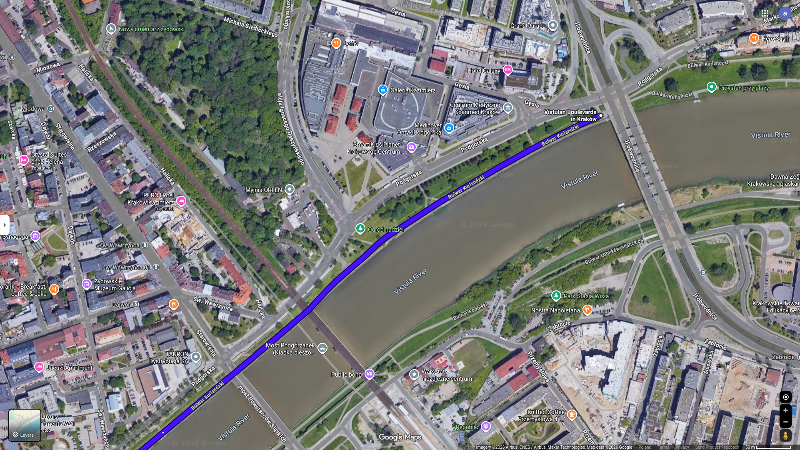
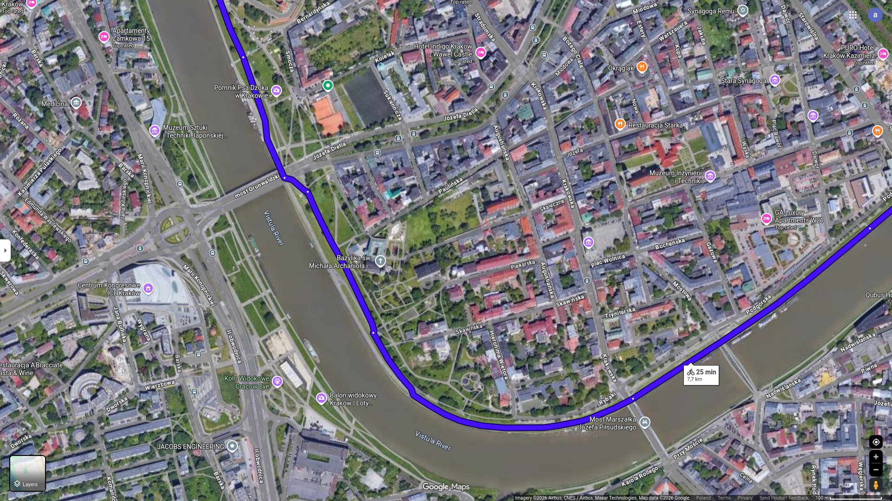

## Vistula and Old City

First do [To The Vistula](to-the-vistula.md)

### Contents

- [Bicycle Route Instruction](instruction.md)
- [Points](#points)
- [Map](#map)
- [Stats](#stats)
- [Trip](#trip)
    - [2026-05-04](#2026-05-04)

#### Points

List of route points for google map

- Coordinates

1. 50.05311988496777, 19.960142634517908
2. 50.05499771348946, 19.933694066065485
3. 50.055591032227554, 19.93572821733991
4. 50.06107200680291, 19.932612559426392
5. 50.06530806850018, 19.941301977546733
6. 50.071692220199886, 19.944326918125366
7. 50.083551477130406, 19.93784807619126

- Names

1. Bulwar Kurlandzki (Most Kotlarski)
2. z Bulwar Czerwieński na ul. Podzamcze
3. z ul. Podzamcze wjazd na Planty
4. Uniwersytet Jagielloński
5. Barbakan
6. Wydział Inżynierii Lądowej PK, Warszawska 24
7. Skrzyżowanie Prądnicka Pielęgniarek

##### For Copying

```text
50.05311988496777, 19.960142634517908
50.05499771348946, 19.933694066065485
50.055591032227554, 19.93572821733991
50.06107200680291, 19.932612559426392
50.06530806850018, 19.941301977546733
50.071692220199886, 19.944326918125366
50.083551477130406, 19.93784807619126
```

[Contents](#contents)

#### Map







[Contents](#contents)

#### Stats

- Time: 25 min
- Length: 7.7 km
- 35 m uphill
- 17 m downhill

#### Trip

##### 2026-05-04

- Start: 18:30
- Temperature: 23 Celsius

"Krakow Planty" are very crowded.  
Extreme awareness for pedestrians required.  

[Contents](#contents)